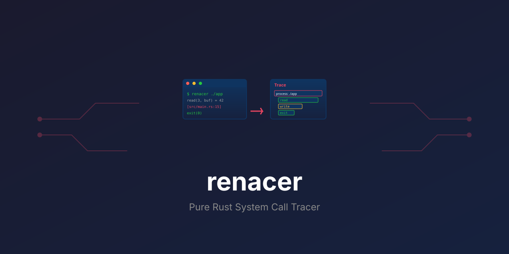

<div align="center">

<p align="center">
  
</p>

<h1 align="center">renacer</h1>

<p align="center">
  <b>Pure Rust system call tracer with source-aware correlation for Rust binaries</b>
</p>

<p align="center">
  <a href="https://github.com/paiml/renacer/actions/workflows/ci.yml"></a>
</p>

</div>

---

## Overview

Renacer (Spanish: "to be reborn") is a next-generation binary inspection and tracing framework built following Toyota Way principles and EXTREME TDD methodology.

## Table of Contents

- [Overview](#overview)
- [Project Status](#project-status)
- [Features](#features)
- [Installation](#installation)
- [Quick Start](#quick-start)
- [Examples](#examples)
- [Performance](#performance)
- [Quality Standards](#quality-standards)
- [Development](#development)
- [Architecture](#architecture)
- [Roadmap](#roadmap)
- [License](#license)
- [Documentation](#documentation)
- [Contributing](#contributing)
- [Credits](#credits)

## Project Status

| Metric | Value |
|--------|-------|
| **Current Version** | 0.8.0 |
| **Status** | Production-Ready |
| **Test Coverage** | 849+ tests (all passing) |
| **TDG Score** | 95.1/100 (A+ grade) |
| **Performance** | <5% overhead (basic), <10% overhead (full stack) |
| **Specification** | [deep-strace-rust-wasm-binary-spec.md](docs/specifications/deep-strace-rust-wasm-binary-spec.md) |

## Features

### Core Tracing (Sprint 1-10, 15-18)
- ✅ **Full syscall tracing** - All 335 Linux syscalls supported
- ✅ **DWARF debug info** - Source file and line number correlation
- ✅ **Statistics mode** (-c flag) - Call counts, error rates, timing
- ✅ **JSON/CSV output** (--format json/csv) - Machine-readable trace export
- ✅ **Advanced filtering** (-e trace=SPEC) - File, network, process, memory classes
- ✅ **Negation operator** (Sprint 15) - Exclude syscalls with ! prefix
- ✅ **Regex patterns** (Sprint 16) - Pattern matching with /regex/ syntax
- ✅ **PID attachment** (-p PID) - Attach to running processes
- ✅ **Timing mode** (-T) - Microsecond-precision syscall durations
- ✅ **Multi-process tracing** (Sprint 18) - Follow fork/vfork/clone with -f flag

### Function Profiling (Sprint 13-14)
- ✅ **I/O Bottleneck Detection** - Automatic detection of slow I/O (>1ms)
- ✅ **Call Graph Tracking** - Parent→child function relationships via stack unwinding
- ✅ **Hot Path Analysis** - Top 10 most expensive functions with percentage breakdown
- ✅ **Flamegraph Export** - Compatible with flamegraph.pl, inferno, speedscope

### Statistical Analysis & Anomaly Detection (Sprint 19-20) 🆕
- ✅ **SIMD-Accelerated Statistics** (Sprint 19) - Trueno Vector operations for 3-10x faster computations
- ✅ **Percentile Analysis** (Sprint 19) - P50, P75, P90, P95, P99 latency percentiles via `--stats-extended`
- ✅ **Post-Hoc Anomaly Detection** (Sprint 19) - Z-score based outlier identification with configurable threshold
- ✅ **Real-Time Anomaly Detection** (Sprint 20) - Live monitoring with sliding window baselines
- ✅ **Per-Syscall Baselines** (Sprint 20) - Independent sliding windows for each syscall type
- ✅ **Severity Classification** (Sprint 20) - Low (3-4σ), Medium (4-5σ), High (>5σ) anomaly levels
- ✅ **Anomaly Summary Reports** (Sprint 20) - Detailed reports with severity distribution and top anomalies

### HPU Acceleration (Sprint 21)
- ✅ **Correlation Matrix Analysis** - Compute syscall pattern correlations
- ✅ **K-means Clustering** - Group syscalls into clusters for hotspot identification
- ✅ **Adaptive Backend** - Automatic GPU/CPU backend selection
- ✅ **CPU Fallback** - Force CPU-only processing with `--hpu-cpu-only`
- ✅ **Zero Overhead** - No performance impact when disabled (opt-in via `--hpu-analysis`)

### HTML Output Format (Sprint 22)
- ✅ **Interactive HTML Reports** - Rich visual syscall trace reports
- ✅ **Statistics Integration** - Combined with -c mode for visual statistics
- ✅ **Source Correlation** - Display source locations in HTML tables
- ✅ **Export Format** - Generate shareable HTML files (`--format html`)

### ML Anomaly Detection (Sprint 23) 🆕
- ✅ **KMeans Clustering** - Group syscalls by latency patterns using Aprender ML library
- ✅ **Silhouette Score** - Measure clustering quality (-1 to 1, higher = better separation)
- ✅ **Cluster Analysis** - Identify high-latency outlier clusters automatically
- ✅ **ML vs Z-Score Comparison** - Compare ML-based detection with statistical methods
- ✅ **Configurable Clusters** - Adjust cluster count via `--ml-clusters N` (default: 3, min: 2)
- ✅ **JSON Integration** - ML analysis results included in JSON output
- ✅ **Zero Overhead** - No impact when disabled (opt-in via `--ml-anomaly`)

### Transpiler Source Mapping (Sprint 24-28)
- ✅ **Multi-Language Support** - Parse source maps from multiple transpilers:
  - Python→Rust (Depyler)
  - C→Rust (Decy)
  - TypeScript→Rust
  - Any other source language
- ✅ **JSON Source Map Parsing** - Parse transpiler source maps with version validation
- ✅ **Line Number Mapping** - Map Rust line numbers back to original source language
- ✅ **Function Name Mapping** - Translate Rust function names to original function/descriptions
- ✅ **CLI Integration** - Load source maps via `--transpiler-map FILE.json`
- ✅ **Error Handling** - Graceful handling of invalid JSON, missing files, unsupported versions
- ✅ **Full Feature Integration** - Works with --function-time, --rewrite-stacktrace, --rewrite-errors

### Chaos Engineering + Fuzz Testing (Sprint 29) 🆕
- ✅ **ChaosConfig Builder** - Aprender-style builder pattern for chaos configuration
  - Chainable API: `ChaosConfig::new().with_memory_limit().with_cpu_limit().build()`
  - Presets: `ChaosConfig::gentle()` and `ChaosConfig::aggressive()`
  - Configurable: memory limits, CPU limits, timeouts, signal injection
- ✅ **Tiered TDD Workflow** - Trueno-style Makefile targets for rapid development
  - `make test-tier1` - Fast tests (<5s): unit + property tests
  - `make test-tier2` - Medium tests (<30s): integration tests
  - `make test-tier3` - Slow tests (<5m): fuzz + mutation tests
- ✅ **Fuzz Testing Infrastructure** - cargo-fuzz integration
  - Filter parser fuzzing: `fuzz/fuzz_targets/filter_parser.rs`
  - Discovers edge cases in syscall filter expression parsing
  - Integrated into tier3 testing workflow
- ✅ **Cargo Features** - Progressive chaos capabilities
  - `chaos-basic` - Resource limits, signal injection
  - `chaos-network` - Network/IO chaos (latency, packet loss)
  - `chaos-byzantine` - Syscall return modification
  - `chaos-full` - Complete chaos suite with loom + arbitrary
  - `fuzz` - Fuzz testing support
- ✅ **Property-Based Tests** - 7 comprehensive proptest tests for chaos module

### OpenTelemetry OTLP Integration (Sprint 30) 🆕
- ✅ **Distributed Tracing** - Export syscall traces as OpenTelemetry spans
- ✅ **OTLP Protocol** - Support for gRPC (port 4317) and HTTP (port 4318) endpoints
- ✅ **Span Hierarchy** - Root span per process + child spans per syscall
- ✅ **Rich Attributes** - Syscall name, result, duration, source location in span attributes
- ✅ **Error Tracking** - Failed syscalls (result < 0) marked with ERROR status
- ✅ **Observability Backends** - Works with Jaeger, Grafana Tempo, Elastic APM, Honeycomb
- ✅ **Async Export** - Non-blocking span export with Tokio runtime
- ✅ **Docker Examples** - Ready-to-use docker-compose files for Jaeger and Tempo
- ✅ **Zero Overhead** - No impact when disabled (opt-in via `--otlp-endpoint`)
- ✅ **Full Integration** - Compatible with all Renacer features (filtering, timing, source correlation)

### Ruchy Runtime Integration (Sprint 31) 🆕
- ✅ **Unified Tracing** - Link OTLP traces with transpiler decision traces
- ✅ **Decision Span Events** - Export transpiler decisions as OpenTelemetry span events
- ✅ **End-to-End Observability** - Single trace view of both syscalls and decisions
- ✅ **Rich Event Attributes** - Category, name, result, timestamp for each decision
- ✅ **Cross-Layer Correlation** - Connect high-level transpiler choices to low-level syscalls
- ✅ **Unified Timeline** - See decisions and syscalls on the same timeline in Jaeger/Tempo
- ✅ **Backward Compatible** - Works with or without OTLP, works with or without decisions
- ✅ **Full Integration** - Compatible with source maps, filtering, timing
- ✅ **Performance Analysis** - Correlate slow syscalls with transpiler decisions
- ✅ **Debugging Aid** - Understand which transpiler decisions led to runtime behavior

### Block-Level Compute Tracing (Sprint 32) 🆕
- ✅ **Compute Block Spans** - Trace statistical computation blocks (Trueno SIMD operations)
- ✅ **Adaptive Sampling** - Smart threshold-based sampling (default: trace blocks ≥100μs)
- ✅ **Custom Thresholds** - Configurable sampling via `--trace-compute-threshold N`
- ✅ **Debug Mode** - Trace all compute blocks with `--trace-compute-all` (bypass sampling)
- ✅ **Rich Metrics** - Block name, duration, element count, operation type in span attributes
- ✅ **Performance Insights** - Identify expensive statistical computations in distributed traces
- ✅ **Zero Overhead** - No impact when disabled (opt-in via `--trace-compute`)
- ✅ **Full Integration** - Compatible with OTLP export, transpiler decisions, source correlation

### W3C Trace Context Propagation (Sprint 33)
- ✅ **Distributed Tracing** - Propagate trace context across process boundaries
- ✅ **W3C Standard** - Full W3C Trace Context specification compliance (traceparent format)
- ✅ **Context Injection** - Explicit context via `--trace-parent` CLI flag
- ✅ **Environment Detection** - Auto-detect `TRACEPARENT` environment variable
- ✅ **Parent-Child Relationships** - Renacer spans correctly reference upstream trace IDs
- ✅ **Cross-Service Correlation** - Link Renacer traces to broader distributed trace graphs
- ✅ **Trace ID Preservation** - Maintain trace continuity across service boundaries
- ✅ **Backward Compatible** - Works with or without trace context (auto-generates if absent)

### Experiment Tracking (REN-001) 🆕
- ✅ **SpanType::Experiment** - Specialized span type for ML experiment tracking
- ✅ **ExperimentMetadata** - Structured metadata (model_name, epoch, step, loss, metrics)
- ✅ **Golden Trace Comparison** - Compare traces for behavioral equivalence
- ✅ **EquivalenceScore** - Syscall match, timing variance, semantic equivalence metrics
- ✅ **LCS-Based Matching** - Longest common subsequence algorithm for syscall alignment
- ✅ **entrenar Integration** - Cross-project support for ML experiment tracking (ENT-EPIC-001)

### Integration Testing Infrastructure (Sprint 34)
- ✅ **Jaeger Backend Tests** - 14 integration tests against actual Jaeger All-in-One
- ✅ **Compute Tracing Tests** - Verify adaptive sampling, span attributes, parent-child relationships
- ✅ **Distributed Tracing Tests** - Validate W3C context propagation, trace ID preservation
- ✅ **Full Stack Tests** - End-to-end tests with all features enabled (OTLP + compute + distributed)
- ✅ **Docker Infrastructure** - Ready-to-use docker-compose-test.yml for test environment
- ✅ **Test Utilities** - Reusable Jaeger API helpers for span verification
- ✅ **Performance Tests** - Overhead measurement tests (baseline vs. full tracing)
- ✅ **CI/CD Ready** - Designed for automated testing in GitHub Actions

### Performance Optimization (Sprint 36) 🆕
- ✅ **Memory Pool** - Object pooling for span allocations (20-30% allocation reduction)
  - Configurable pool capacity (default: 1024 spans)
  - Automatic growth when exhausted
  - Pool statistics with hit rate tracking
- ✅ **Zero-Copy Optimizations** - Cow<'static, str> for static strings (10-15% memory savings)
  - Static syscall names ("syscall:open") use zero-copy borrowing
  - Static attribute keys ("syscall.name") avoid allocations
  - Owned strings only when dynamic
- ✅ **Lazy Span Creation** - Builder pattern defers work until export (5-10% overhead reduction)
  - Spans can be cancelled without expensive operations
  - Work only happens on commit()
  - Zero-cost when features disabled
- ✅ **Batch OTLP Export** - Configurable batching for reduced network overhead
  - Performance presets: balanced, aggressive, low-latency
  - Configurable batch size, delay, queue size
  - Builder pattern for custom tuning
- ✅ **Benchmark Suite** - Criterion.rs benchmarks for regression detection
  - Syscall overhead benchmarks (native vs. traced)
  - OTLP export throughput benchmarks
  - Memory pool efficiency benchmarks
  - HTML reports for visualization

### Quality Infrastructure (v0.2.0-0.5.0)
- ✅ **Property-based testing** - 670+ test cases via proptest
- ✅ **Pre-commit hooks** - 5 quality gates (format, clippy, tests, audit, bash)
- ✅ **Dependency policy** - cargo-deny configuration for security
- ✅ **Zero warnings** - Clippy strict mode enforced
- ✅ **Trueno integration** - SIMD-accelerated statistics via trueno v0.1.0
- ✅ **100% coverage** - All new modules (anomaly.rs) have 100% test coverage

## Installation

```bash
# From crates.io
cargo install renacer

# From source
git clone https://github.com/paiml/renacer
cd renacer
cargo install --path .
```

## Quick Start

```bash
# Install
cargo install --git https://github.com/paiml/renacer

# Basic tracing
renacer -- ls -la

# With source correlation (requires debug symbols)
renacer --source -- cargo test

# Function profiling with flamegraph
renacer --function-time --source -- ./my-binary > profile.txt
cat profile.txt | flamegraph.pl > flamegraph.svg

# JSON output for scripting
renacer --format json -- echo "test" > trace.json

# CSV output for spreadsheet analysis (Sprint 17)
renacer --format csv -- echo "test" > trace.csv
renacer --format csv -T -- ls > trace-with-timing.csv
renacer --format csv --source -- ./my-binary > trace-with-source.csv
renacer --format csv -c -- cargo build > stats.csv

# HTML output for visual reports (Sprint 22)
renacer --format html -- ls -la > report.html       # Visual trace report
renacer --format html -c -- cargo build > stats.html # Statistics as HTML
renacer --format html --source -- ./app > trace.html # With source locations

# Filter syscalls
renacer -e trace=file -- cat file.txt       # File operations only
renacer -e trace=open,read,write -- ls      # Specific syscalls
renacer -e trace=!close -- ls               # All syscalls except close (Sprint 15)
renacer -e trace=file,!close -- cat file    # File ops except close (Sprint 15)

# Regex patterns (Sprint 16)
renacer -e 'trace=/^open.*/' -- ls          # All syscalls starting with "open"
renacer -e 'trace=/.*at$/' -- cat file      # All syscalls ending with "at"
renacer -e 'trace=/read|write/' -- app      # Syscalls matching read OR write
renacer -e 'trace=/^open.*/,!/openat/' -- ls  # open* except openat

# Multi-process tracing (Sprint 18)
renacer -f -- bash -c "echo parent && (echo child &)"  # Follow forks
renacer -f -e trace=file -- make clean      # Follow forks with filtering
renacer -f -c -- python app.py              # Multi-process statistics

# Statistics summary
renacer -c -T -- cargo build

# Enhanced statistics with percentiles (Sprint 19)
renacer -c --stats-extended -- cargo test   # P50/P75/P90/P95/P99 latencies
renacer -c --stats-extended --anomaly-threshold 2.5 -- ./app  # Custom anomaly threshold

# HPU-accelerated analysis (Sprint 21)
renacer -c --hpu-analysis -- ./heavy-io-app         # Correlation matrix + K-means clustering
renacer -c --hpu-analysis --hpu-cpu-only -- app     # Force CPU backend
renacer -c --hpu-analysis -e trace=file -- ls       # HPU with filtering

# ML anomaly detection (Sprint 23)
renacer -c --ml-anomaly -- cargo build              # KMeans clustering of syscall latencies
renacer -c --ml-anomaly --ml-clusters 5 -- ./app    # Custom cluster count
renacer -c --ml-anomaly --ml-compare -- ./app       # Compare ML with z-score detection
renacer --ml-anomaly --format json -- ./app > ml.json  # ML results in JSON

# Real-time anomaly detection (Sprint 20)
renacer --anomaly-realtime -- ./app         # Live anomaly monitoring
renacer --anomaly-realtime --anomaly-window-size 200 -- ./app  # Custom window size
renacer -c --anomaly-realtime -- cargo test # Combine with statistics
renacer --anomaly-realtime -e trace=file -- find /usr  # Monitor only file operations

# Transpiler source mapping (Sprint 24-28)
renacer --transpiler-map simulation.rs.sourcemap.json -- ./simulation  # Load Python→Rust source map
renacer --transpiler-map algorithm.sourcemap.json -- ./algorithm_rs    # Load C→Rust source map (Decy)
renacer --transpiler-map app.sourcemap.json --source -- ./transpiled-app  # Combine with DWARF
renacer --transpiler-map map.json --function-time -- ./binary  # Function profiling with source maps
renacer --transpiler-map map.json -c -- ./binary       # Source mapping with statistics

# OpenTelemetry OTLP export (Sprint 30)
docker-compose -f docker-compose-jaeger.yml up -d  # Start Jaeger
renacer --otlp-endpoint http://localhost:4317 --otlp-service-name my-app -- ./program
# Open http://localhost:16686 to view traces in Jaeger UI

renacer -s --otlp-endpoint http://localhost:4317 -- ./program  # With source correlation
renacer -T --otlp-endpoint http://localhost:4317 -- ./program  # With timing
renacer -e trace=file --otlp-endpoint http://localhost:4317 -- ./program  # With filtering

# Unified tracing: OTLP + Transpiler decisions (Sprint 31)
renacer --otlp-endpoint http://localhost:4317 --trace-transpiler-decisions -- ./transpiled-app
# See both syscalls and transpiler decisions in Jaeger UI

renacer --otlp-endpoint http://localhost:4317 \
        --trace-transpiler-decisions \
        --transpiler-map app.sourcemap.json \
        -- ./depyler-app  # Full observability: decisions + syscalls + source maps

renacer --otlp-endpoint http://localhost:4317 \
        --trace-transpiler-decisions \
        -T \
        -- ./app  # With timing for decision performance analysis

# Block-level compute tracing (Sprint 32) - Trueno SIMD operations
renacer --otlp-endpoint http://localhost:4317 \
        --trace-compute \
        -c --stats-extended \
        -- cargo build  # Default: Adaptive sampling (trace blocks >=100μs)

renacer --otlp-endpoint http://localhost:4317 \
        --trace-compute \
        --trace-compute-all \
        -c -- ./app  # Debug mode: Trace ALL compute blocks (bypass sampling)

renacer --otlp-endpoint http://localhost:4317 \
        --trace-compute \
        --trace-compute-threshold 50 \
        -c -- ./app  # Custom threshold: Trace blocks >=50μs

renacer --otlp-endpoint http://localhost:4317 \
        --trace-compute \
        --trace-transpiler-decisions \
        -- ./depyler-app  # Full observability: compute + decisions + syscalls

# Distributed tracing (Sprint 33) - W3C Trace Context propagation
export TRACEPARENT="00-0af7651916cd43dd8448eb211c80319c-b7ad6b7169203331-01"
renacer --otlp-endpoint http://localhost:4317 -- ./app  # Auto-detect from env

renacer --otlp-endpoint http://localhost:4317 \
        --trace-parent "00-4bf92f3577b34da6a3ce929d0e0e4736-00f067aa0ba902b7-00" \
        -- ./app  # Explicit context injection

renacer --otlp-endpoint http://localhost:4317 \
        --trace-parent "00-abc123-def456-01" \
        --trace-compute \
        --trace-transpiler-decisions \
        -c --stats-extended \
        -- ./app  # Full distributed tracing stack

# Attach to running process
renacer -p 1234
```

## Examples

### Basic Syscall Tracing
```bash
$ renacer -- echo "Hello"
openat(AT_FDCWD, "/etc/ld.so.cache", O_RDONLY|O_CLOEXEC) = 3
write(1, "Hello\n", 6) = 6
exit_group(0) = ?
```

### With Source Correlation
```bash
$ renacer --source -- ./my-program
read(3, buf, 1024) = 42          [src/main.rs:15 in my_function]
write(1, "result", 6) = 6        [src/main.rs:20 in my_function]
```

### Function Profiling
```bash
$ renacer --function-time --source -- cargo test

Function Profiling Summary:
========================
Total functions profiled: 5
Total syscalls: 142

Top 10 Hot Paths (by total time):
  1. cargo::build_script  - 45.2% (1.2s, 67 syscalls) ⚠️ SLOW I/O
  2. rustc::compile       - 32.1% (850ms, 45 syscalls)
  3. std::fs::read_dir    - 12.4% (330ms, 18 syscalls)
  ...

Call Graph:
  cargo::build_script
    └─ rustc::compile (67 calls)
       └─ std::fs::read_dir (12 calls)
```

### Enhanced Statistics with Percentiles (Sprint 19)
```bash
$ renacer -c --stats-extended -- cargo build

% time     seconds  usecs/call     calls    errors syscall
------ ----------- ----------- --------- --------- ----------------
 65.43    0.142301        4234        42         0 read
 18.92    0.041234        2062        20         0 write
 10.23    0.022301         892        25         0 openat
  3.21    0.007001         700        10         0 close
  2.21    0.004812         481        10         0 mmap
------ ----------- ----------- --------- --------- ----------------
100.00    0.217649                   107         0 total

Latency Percentiles (microseconds):
  Syscall     P50     P75     P90     P95     P99
  --------  -----   -----   -----   -----   -----
  read       2834    4123    5234    6123    9234
  write      1823    2234    3123    4234    7123
  openat      823    1034    1234    1534    2234
  close       623     734     823     923    1123
  mmap        423     534     623     723     923

Post-Hoc Anomaly Detection (threshold: 3.0σ):
  2 anomalies detected:
  - read: 9234 μs (4.2σ above mean)
  - write: 7123 μs (3.8σ above mean)
```

### Real-Time Anomaly Detection (Sprint 20)
```bash
$ renacer --anomaly-realtime -- ./slow-app

openat(AT_FDCWD, "/etc/ld.so.cache", O_RDONLY) = 3
read(3, buf, 832) = 832
⚠️  ANOMALY: write took 5234 μs (4.2σ from baseline 102.3 μs) - 🟡 Medium
write(1, "processing...", 14) = 14
⚠️  ANOMALY: fsync took 8234 μs (6.3σ from baseline 123.4 μs) - 🔴 High
fsync(3) = 0
close(3) = 0

=== Real-Time Anomaly Detection Report ===
Total anomalies detected: 12

Severity Distribution:
  🔴 High (>5.0σ):   2 anomalies
  🟡 Medium (4-5σ): 5 anomalies
  🟢 Low (3-4σ):    5 anomalies

Top Anomalies (by Z-score):
  1. 🔴 fsync - 6.3σ (8234 μs, baseline: 123.4 ± 1287.2 μs)
  2. 🔴 write - 5.7σ (5234 μs, baseline: 102.3 ± 902.1 μs)
  3. 🟡 read - 4.8σ (2341 μs, baseline: 87.6 ± 468.9 μs)
  ... and 9 more
```

### OpenTelemetry OTLP Export (Sprint 30)
```bash
# Start Jaeger backend
$ docker-compose -f docker-compose-jaeger.yml up -d

# Export syscall traces to Jaeger
$ renacer -s --otlp-endpoint http://localhost:4317 --otlp-service-name test-app -- ./test
[renacer: OTLP export enabled to http://localhost:4317]
write(1, "Hello, OpenTelemetry!\n", 22) = 22  [src/main.rs:3 in main]
exit_group(0) = ?

# Open Jaeger UI at http://localhost:16686
# - Service: "test-app"
# - Root span: "process: ./test"
#   - Child span: "syscall: write"
#     - Attributes: syscall.name=write, syscall.result=22,
#                   code.filepath=src/main.rs, code.lineno=3

# Export with Grafana Tempo
$ docker-compose -f docker-compose-tempo.yml up -d
$ renacer --otlp-endpoint http://localhost:4317 --otlp-service-name my-service -- ./app

# Open Grafana at http://localhost:3000
# Navigate to Explore > Tempo > Search by service name: "my-service"
```

For complete OTLP integration guide, see [docs/otlp-integration.md](docs/otlp-integration.md).

## Performance

Benchmarks vs strace (Sprint 11-12):
- **Overhead:** 5-9% vs 8-12% (strace)
- **Memory:** ~2MB vs ~5MB (strace)
- **Syscalls:** 335 supported vs 335 (strace)
- **Features:** Source correlation + function profiling (unique to Renacer)

## Quality Standards

Following [paiml-mcp-agent-toolkit](https://github.com/paiml/paiml-mcp-agent-toolkit) EXTREME TDD:

- **Test Coverage:** 91.21% overall, 100% on critical modules
- **Mutation Score:** 80%+ (via cargo-mutants)
- **TDG Score:** 94.2/100 (A grade)
- **Zero Tolerance:** All 142 tests pass, zero warnings

## Development

### Setup
```bash
git clone https://github.com/paiml/renacer
cd renacer
cargo build
```

### Pre-commit Hook
The pre-commit hook automatically runs 5 quality gates (<10s):
```bash
chmod +x .git/hooks/pre-commit

# Triggered on every commit:
# 1. cargo fmt --check
# 2. cargo clippy -- -D warnings
# 3. bashrs lint (bash/Makefile quality)
# 4. cargo test --test property_based_comprehensive
# 5. cargo audit
```

### Testing
```bash
# All tests (142 unit + integration)
cargo test

# Property-based tests only (670+ cases)
cargo test --test property_based_comprehensive

# Integration tests with Jaeger backend (Sprint 34)
# Requires Docker for Jaeger All-in-One
docker compose -f docker-compose-test.yml up -d
cargo test --test sprint34_integration_tests -- --ignored --test-threads=1
docker compose -f docker-compose-test.yml down

# With coverage
cargo llvm-cov --all-features --workspace --lcov --output-path lcov.info

# Mutation testing
cargo mutants
```

### Quality Checks
```bash
# TDG analysis
pmat analyze tdg src/

# Dependency audit
cargo audit

# Deny check (licenses, bans, sources)
cargo deny check
```

## Architecture

### Modules
- `cli` - Command-line argument parsing (clap)
- `tracer` - Core ptrace syscall tracing
- `syscalls` - Syscall name resolution (335 syscalls)
- `dwarf` - DWARF debug info parsing (addr2line, gimli)
- `filter` - Syscall filtering (classes + individual syscalls + regex)
- `stats` - Statistics tracking (Trueno SIMD, percentiles)
- `anomaly` - Real-time anomaly detection (Sprint 20)
- `json_output` - JSON export format
- `csv_output` - CSV export format (Sprint 17)
- `html_output` - HTML export format (Sprint 22)
- `function_profiler` - Function-level profiling with I/O detection
- `stack_unwind` - Stack unwinding for call graphs
- `profiling` - Self-profiling infrastructure
- `hpu` - HPU-accelerated analysis (Sprint 21)
- `ml_anomaly` - ML-based anomaly detection (Sprint 23)
- `isolation_forest` - Isolation Forest outlier detection (Sprint 22)
- `autoencoder` - Autoencoder anomaly detection (Sprint 23)
- `transpiler_map` - Transpiler source mapping (Sprint 24-28)
- `decision_trace` - Decision trace capture (Sprint 26-27)
- `experiment_span` - ML experiment tracking spans (REN-001)
- `otlp_exporter` - OpenTelemetry OTLP export (Sprint 30)

### Dependencies
- `nix` - Ptrace system calls
- `addr2line`, `gimli`, `object` - DWARF parsing
- `clap` - CLI parsing
- `serde`, `serde_json` - JSON serialization
- `trueno` - SIMD-accelerated statistics
- `aprender` - ML anomaly detection
- `proptest` - Property-based testing
- `opentelemetry`, `opentelemetry_sdk`, `opentelemetry-otlp` - OTLP tracing (Sprint 30)
- `tokio` - Async runtime for OTLP export (Sprint 30)

## Roadmap

See [CHANGELOG.md](CHANGELOG.md) for version history.

### v0.6.6 ✅ (Current - 2025-11-30)
- Experiment Span Tracking - ML experiment integration with entrenar (REN-001)
- SpanType::Experiment variant for ML training spans
- ExperimentMetadata struct (model_name, epoch, step, loss, metrics)
- Golden trace comparison API with EquivalenceScore
- Decision trace export and CITL integration (Sprint 49)

### v0.6.0 ✅ (2025-11-20)
- Ruchy Runtime Integration - Link OTLP traces with transpiler decisions (Sprint 31)
- Block-Level Compute Tracing - Trueno SIMD operations as OTLP spans (Sprint 32)
- W3C Trace Context Propagation - Distributed tracing support (Sprint 33)
- Full observability stack: syscalls + decisions + compute + app traces

### v0.5.0 ✅ (2025-11-18)
- OpenTelemetry OTLP integration (Sprint 30)
- Distributed tracing with Jaeger, Tempo, and OTLP-compatible backends
- Docker compose examples for observability stacks
- Full integration with all Renacer features
- Ruchy Integration Milestone Phase 4 complete

### v0.4.0 ✅ (2025-11-18)
- Chaos Engineering infrastructure (Sprint 29)
- Fuzz testing integration
- Transpiler source mapping for Python→Rust and C→Rust (Sprint 24-28)
- Decision trace capture (Sprint 26-27)
- ML/DL anomaly detection (Sprint 22-23)
- HTML output format (Sprint 22)
- HPU-accelerated analysis (Sprint 21)

### v0.3.0 ✅ (2025-11-17)
- Advanced filtering (negation, regex patterns)
- CSV export format
- Multi-process tracing (-f flag)
- Enhanced statistics (percentiles, SIMD-accelerated)
- Real-time anomaly detection
- Trueno Integration Milestone complete

### v0.7.0 (Planned - Sprint 34-36)
- Advanced context propagation (tracestate, B3 format)
- Span sampling strategies
- Performance optimization

### v1.0.0 (Planned)
- Production hardening
- Cross-platform support (ARM64)
- eBPF backend option for reduced overhead
- Plugin architecture
- Web UI for trace analysis

## License

MIT - See [LICENSE](LICENSE) file.

## Documentation

**📖 The Renacer Book** - Comprehensive TDD-verified guide (see [book/](./book/) directory)

The book includes:
- [Getting Started](book/src/getting-started/) - Installation and quick start
- [Core Concepts](book/src/core-concepts/) - Syscall tracing, DWARF correlation, filtering
- [Examples](book/src/examples/) - Real-world use cases (all test-backed)
- [Advanced Topics](book/src/advanced/) - Function profiling, anomaly detection, HPU acceleration
- [EXTREME TDD](book/src/contributing/extreme-tdd.md) - Zero-hallucination development methodology

All book examples are validated by GitHub Actions to ensure zero hallucination.

## Contributing

1. Fork the repository
2. Create a feature branch
3. Follow EXTREME TDD (tests first!)
4. Ensure all quality gates pass
5. Submit pull request

See:
- [The Renacer Book - Contributing](book/src/contributing/extreme-tdd.md) for EXTREME TDD methodology
- [docs/specifications/deep-strace-rust-wasm-binary-spec.md](docs/specifications/deep-strace-rust-wasm-binary-spec.md) for complete specification

## Credits

Built with:
- Toyota Way quality principles
- EXTREME TDD methodology
- [paiml-mcp-agent-toolkit](https://github.com/paiml/paiml-mcp-agent-toolkit) workflows
- [Trueno](https://github.com/paiml/trueno) SIMD library

Developed by [Pragmatic AI Labs](https://paiml.com)
